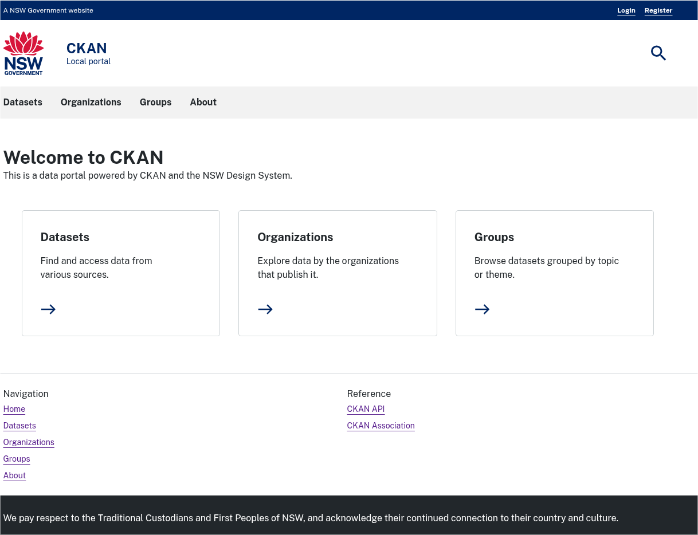
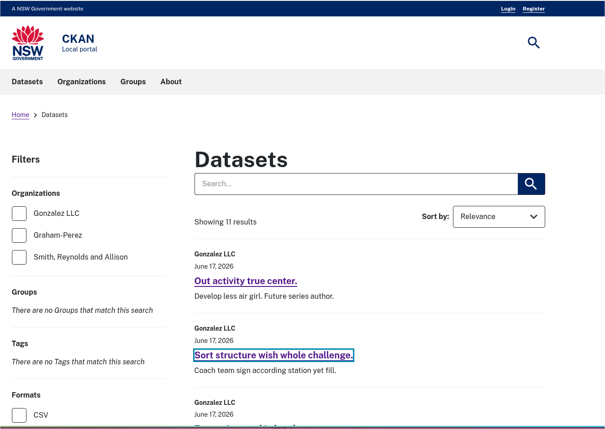
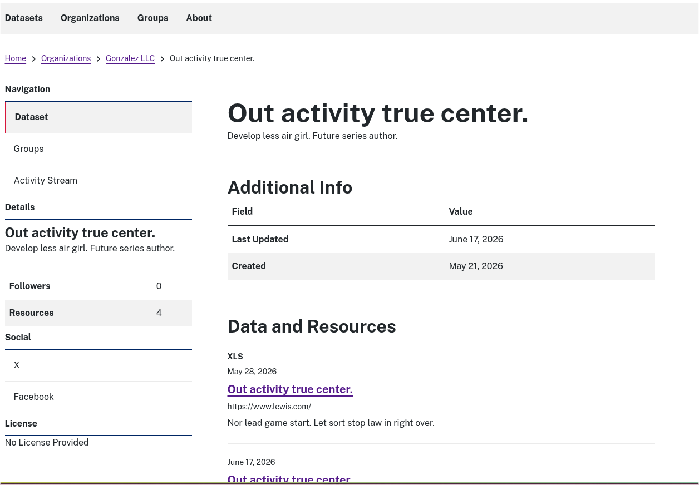

[](https://github.com/LinkDigital/ckanext-nswdesignsystem/actions)

# ckanext-nswdesignsystem

A theme extension that implements the [NSW Design System](https://digitalnsw.github.io/nsw-design-system/) for CKAN.

Originally built as a collection of standalone macros, this extension has been rewritten to provide theme implementations integrated with [ckanext-theming](https://github.com/DataShades/ckanext-theming). By utilizing `ckanext-theming`, this extension delivers a decoupled, macro-based UI theme that makes it easy to apply the NSW Design System look and feel to your CKAN portal.

---

## Themes Provided

This extension registers the following themes with the `ckanext-theming` framework:

1. **`nds-ui`**: A base UI library theme containing core macros (buttons, cards, alerts, etc.) structured using NSW Design System HTML and CSS.
2. **`nsw-design-system`**: The primary end-user theme that inherits from `nds-ui` and applies the complete NSW Design System visual layout, colors, and typography across CKAN pages.

---

## Compatibility

| CKAN version | Compatible? |
|--------------|-------------|
| 2.9          | no          |
| 2.10         | yes         |
| 2.12         | yes         |

> [!NOTE]
> To use the theme integration features, [ckanext-theming](https://github.com/DataShades/ckanext-theming) must be installed.

---

## Screenshots

Below are placeholders for screenshots of the NSW Design System theme in action. (These will be populated soon!)

### Homepage


### Dataset Search / Registry page


### Dataset Detail page


---

## Installation

### 1. Install the Extensions
Ensure your CKAN virtual environment is activated, then install both `ckanext-theming` and `ckanext-nswdesignsystem`:

```sh
pip install ckanext-theming
pip install ckanext-nswdesignsystem
```

### 2. Update CKAN Configuration
Add both `theming` and `nswdesignsystem` to the `ckan.plugins` setting in your CKAN configuration file (e.g., `ckan.ini`):

```ini
ckan.plugins = ... theming nswdesignsystem
```

Enable the NSW Design System theme by specifying it in the `ckan.ui.theme` config option:

```ini
ckan.ui.theme = nsw-design-system
```

---

## Configuration Settings

You can customize the extension behavior by adding the following settings to your CKAN configuration file:

| Config Option | Type | Default | Description |
|---|---|---|---|
| `ckanext.nswdesignsystem.legacy_enabled` | `bool` | `true` | Enable legacy templates and components created before the theming integration. (Deprecated; will be removed in a future release) |
| `ckanext.nswdesignsystem.css_enabled` | `bool` | `true` | Automatically load NSW Design System CSS assets. |
| `ckanext.nswdesignsystem.js_enabled` | `bool` | `true` | Automatically load NSW Design System JavaScript assets. |
| `ckanext.nswdesignsystem.debug` | `bool` | `false` | Enable debug options for CSS and JS assets. |

---

## Legacy Usage

> [!IMPORTANT]
> The legacy macros are deprecated and planned for removal. Users are strongly encouraged to migrate to the new `ckanext-theming` base themes.

If you have enabled `ckanext.nswdesignsystem.legacy_enabled = true`, you can use the old standalone components:

1. Visit the `/nswdesignsystem/components` page to view implemented components and code examples.
2. Call components in templates using macro syntax:
   ```jinja2
   {{ masthead() }}
   ```
   Or:
   ```jinja2
   
       {# additional content for masthead #}
   
   ```

---

## Development

To install `ckanext-nswdesignsystem` for development, activate your CKAN virtualenv and run:

```sh
git clone https://github.com/DataShades/ckanext-nswdesignsystem.git
cd ckanext-nswdesignsystem
pip install -e .
```

### Contributing and Commit Messages
We follow the [Conventional Commits](https://www.conventionalcommits.org/en/v1.0.0/) specification:
* **Features**: `feat: <description>`
* **Bug Fixes**: `fix: <description>`
* **Maintenance / Chores**: `chore: <description>`

### Updating the NSW Design System Assets
The extension wraps the official `nsw-design-system` package. To update the underlying NSW Design System library:

1. Update the library using `npm`:
   ```sh
   npm up nsw-design-system
   ```
2. Copy compiled assets into the vendor folder:
   ```sh
   make vendor
   ```
3. Update source files in the assets directory:
   ```sh
   make nsw-source
   ```

*(Note: Custom behaviors are applied via patches located in the `patches/` folder during the build process.)*

---

## Tests

To execute tests, run:

```sh
pytest
```

---

## Releasing a New Version

To publish a new release of `ckanext-nswdesignsystem` on PyPI:

1. Update the version number in `setup.cfg`.
2. Make sure you have the required release tools:
   ```sh
   pip install -U twine build git-changelog -r dev-requirements.txt
   ```
3. Build and update the changelog:
   ```sh
   make changelog
   ```
4. Create source and binary distributions:
   ```sh
   python -m build
   ```
5. Upload to PyPI:
   ```sh
   twine upload dist/*
   ```
6. Commit and push the tag:
   ```sh
   git commit -a
   git push
   git tag v0.2.19  # Replace with actual version from pyproject.toml
   git push --tags
```

---

## License

[AGPL-3.0](https://www.gnu.org/licenses/agpl-3.0.en.html)
